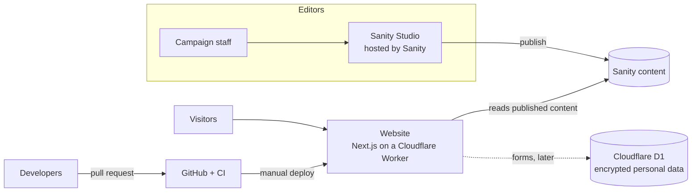
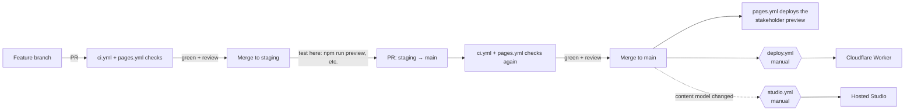

# Dominic Howard for Tennessee — campaign website

[](https://github.com/Oso-Nice-Sites/dominic4tn/actions/workflows/ci.yml)

The website for Dominic Howard's campaign for Tennessee State House, District 46.
Campaign staff edit the site in a hosted content editor ([Sanity](https://www.sanity.io));
the site itself is a [Next.js](https://nextjs.org) app that runs on
[Cloudflare Workers](https://developers.cloudflare.com/workers/).

> **Status:** homepage, CMS, and CI are in place. Still to build: the volunteer / yard-sign /
> contact / RSVP forms and their API routes, the staff export tool, and the third-party
> integrations. See [What is not built yet](#what-is-not-built-yet).

**Contents**
[Architecture](#architecture) · [Getting started](#getting-started) · [Configuration](#configuration) ·
[Project layout](#project-layout) · [Content management (Sanity)](#content-management-sanity) ·
[Deploying to Cloudflare](#deploying-to-cloudflare) · [CI/CD](#cicd) ·
[Stakeholder preview](#stakeholder-preview-github-pages) · [Database](#database-cloudflare-d1--drizzle) ·
[Testing & quality](#testing--quality) · [Security](#security-and-privacy) ·
[Troubleshooting](#troubleshooting) · [What is not built yet](#what-is-not-built-yet)

---

## Architecture



| Concern | Choice |
| --- | --- |
| Framework | Next.js 16 (App Router), React 19, TypeScript, Tailwind CSS 4 |
| Hosting | Cloudflare Workers via [OpenNext](https://opennext.js.org/cloudflare) |
| Content | Sanity (content model in `src/sanity/`, editor = Sanity Studio) |
| Database | Cloudflare D1 (SQLite) with Drizzle ORM — for form submissions, not built yet |
| Personal data | Encrypted at the field level (AES-256-GCM, `src/lib/crypto.ts`) |
| Donations | ActBlue (the site links to the campaign's ActBlue page) |
| CI/CD | GitHub Actions |

**How a page reaches a visitor.** Each request renders on the Worker, reads the *published*
content from Sanity, and falls back to the built-in copy in `src/content/defaults.ts` for
anything missing. Because pages render per request, **a publish in the Studio is live on the
next page load — no rebuild or redeploy.** If Sanity is unreachable, the error is logged and
the site keeps serving the built-in content instead of failing.

**Why the Studio is hosted separately (not inside the site).** Embedding it in the Worker
grew the compressed Worker from about 1.0 MiB to about 4.1 MiB, over Cloudflare's 3 MiB
Free-plan limit (limits change; check the current
[Workers limits](https://developers.cloudflare.com/workers/platform/limits/)). Hosting it
on Sanity keeps the site tiny and lets the Studio be updated independently. CI enforces the
size limit — see [CI/CD](#cicd).

---

## Getting started

**Prerequisites**

- Node.js **24** (`.nvmrc`; anything ≥ 20.19 works). With nvm: `nvm install 24 && nvm use`
- npm (ships with Node)
- Optional for the full stack: a Sanity account and a Cloudflare account (see below)

```bash
git clone https://github.com/Oso-Nice-Sites/dominic4tn.git
cd dominic4tn
npm ci
npm run dev        # http://localhost:3000
```

The site works immediately with **no accounts and no environment variables** — it shows the
built-in content. Connect Sanity when you want to edit content
([setup](#one-time-setup-for-developers)).

### Scripts

| Command | What it does |
| --- | --- |
| `npm run dev` | Local dev server with hot reload |
| `npm run build` / `npm start` | Production build / serve it locally |
| `npm run typecheck` | Regenerate route types, then `tsc --noEmit` |
| `npm run lint` | ESLint |
| `npm test` | Unit tests (Vitest) |
| `npm run preview` | Build for Cloudflare and run it locally in the real Workers runtime |
| `npm run deploy` | Build and deploy to Cloudflare (needs credentials) |
| `npm run studio` | Run the content editor locally at http://localhost:3333 |
| `npm run studio:build` / `studio:deploy` | Build / publish the content editor to Sanity's hosting |
| `npm run seed:generate` | Regenerate `src/sanity/seed.ndjson` from the built-in defaults (needs Node 22.18+ or 24) |
| `npm run seed:import` | Import the seed into your Sanity dataset (never overwrites) |
| `npm run build:pages` | Build the static GitHub Pages preview locally |
| `npm run db:generate` | Generate a Drizzle migration from `src/db/schema.ts` |
| `npm run db:migrate:local` / `db:migrate:remote` | Apply migrations to the local / production D1 database |
| `npm run cf-typegen` | Regenerate `cloudflare-env.d.ts` after changing `wrangler.jsonc` |

---

## Configuration

Copy [`.env.example`](.env.example) to `.env.local` (gitignored) for the Sanity settings and
[`.dev.vars.example`](.dev.vars.example) to `.dev.vars` (gitignored) for Worker secrets.
**Never commit real secrets.**

| Variable | Where | Secret? | Purpose |
| --- | --- | --- | --- |
| `NEXT_PUBLIC_SANITY_PROJECT_ID` | site (build time) | no | Sanity project the site reads. Unset → built-in content |
| `NEXT_PUBLIC_SANITY_DATASET` | site (build time) | no | Dataset name (default `production`) |
| `NEXT_PUBLIC_SANITY_API_VERSION` | site (build time) | no | Sanity API date (default `2025-01-01`) |
| `SANITY_API_READ_TOKEN` | site (runtime) | **yes** | Only for a *private* dataset; also makes the site bypass Sanity's CDN |
| `SANITY_STUDIO_PROJECT_ID` / `_DATASET` | Studio | no | Same project/dataset, in the form Sanity's tooling exposes to the Studio |
| `SANITY_STUDIO_HOST` | Studio deploy | no | The `<name>` in `https://<name>.sanity.studio` |
| `FIELD_ENCRYPTION_KEY` | Worker secret | **yes** | AES-256 key for personal data — **losing it makes stored data unreadable** |
| `CLOUDFLARE_API_TOKEN`, `CLOUDFLARE_ACCOUNT_ID` | GitHub secrets | **yes** | Used by `deploy.yml` |
| `SANITY_AUTH_TOKEN` | GitHub secret | **yes** | Used by `studio.yml` |
| `GITHUB_PAGES`, `PAGES_BASE_PATH` | CI only | no | Switch on the static preview build |

> `NEXT_PUBLIC_*` values are baked in when the site is **built**. After changing one, rebuild
> and redeploy. A site built without `NEXT_PUBLIC_SANITY_PROJECT_ID` will show built-in
> content even if you later add the variable at runtime.

---

## Project layout

```
src/
  app/
    layout.tsx              document shell + fonts
    (site)/                 the public website
      layout.tsx            header, footer, skip link (site settings come from the CMS)
      page.tsx              Home  (the CMS page whose address is "home")
      [slug]/page.tsx       every other CMS page, at /<address>
      not-found.tsx         404 page
  components/
    sections/               one component per CMS section type + PageSections.tsx
    Header, Footer, ...     site chrome
  content/defaults.ts       built-in content: fallback AND source of the seed data
  sanity/
    schemaTypes/            the content model (documents, sections, building blocks)
    structure.ts            the Studio sidebar
    queries.ts              GROQ queries (page links resolved to plain hrefs)
    content.ts              fetch layer: Sanity first, built-in defaults as fallback
    seed.ts, seed.ndjson    initial content for a new Sanity dataset
  db/                       Drizzle schema + D1 client
  lib/crypto.ts             field-level encryption
sanity.config.ts            Studio configuration
drizzle/                    generated SQL migrations
infra/cloudflare-access/    placeholder Cloudflare Access config for /admin/*
.github/workflows/          ci.yml, pages.yml, deploy.yml, studio.yml
```

---

## Content management (Sanity)

### For campaign editors

Open the content editor at **https://dominic-howard-campaign.sanity.studio** and sign in with
the account you were invited with.

- **Site settings** — candidate name, contact email and phone, the donation link, the
  “Paid for by” disclaimer, the top menu, and the small links at the bottom of every page.
- **Pages → Home** — the home page. Every page is a stack of **sections** you can add, edit,
  reorder (drag), and delete: *Big banner*, *Text (with optional photo)*, *Big quote*,
  *Numbers strip*, *Cards*, and *Call to action (buttons)*.
- **Adding a page** — Pages → **+** → give it a title, click **Generate** for its web address
  (e.g. `volunteer` becomes `/volunteer`), and build it from sections. To put it in the menu,
  add it under **Site settings → Menu links** and choose it from the page list.
- **Photos** — add one in a *Text* section. **A description of the photo is required** (it is
  read aloud to people using screen readers). Use the crop/hotspot tool to choose what stays
  in frame on phones.
- **Publishing** — your edits are a *draft* until you click **Publish**. Only published content
  appears on the website, and it appears on the next page load. There is nothing to
  deploy.

Please don't delete the **Home** page or **Site settings**. If either is missing, the site falls
back to its built-in text, which may be out of date.

### For developers

#### How it works

- **Content model** (`src/sanity/schemaTypes/`): a `page` document is a list of `sections`; a
  singleton `siteSettings` document holds site-wide details. The Home page is the page with
  address `home` (`page-home`); privacy and accessibility ship as ordinary pages.
- **Reads** (`src/sanity/content.ts`): published perspective, Sanity's CDN (or a token if set).
  Editor values win; empty fields fall back to `src/content/defaults.ts`; a menu an editor
  emptied on purpose stays empty.
- **Per-request rendering:** pages call `connection()` so they are never prerendered at build.
  Do not add `generateStaticParams` to `(site)/[slug]` in normal builds — it makes Next treat
  the route as pre-generated and per-request rendering then fails (`DYNAMIC_SERVER_USAGE`).
  It is defined only for the static preview build, where it must exist.
- **Images** come from Sanity's image CDN and are rendered with `next/image` `unoptimized`
  (Sanity already resizes and compresses them).
- **Links** to pages are references in the CMS and are resolved to `href`s in GROQ, so
  renaming a page's address never breaks a menu link. A link to an unpublished page is dropped.

#### One-time setup (for developers)

1. **Create the Sanity project** at <https://www.sanity.io/manage> (dataset `production`).
   Note the **Project ID**.
2. **Configure env:** `cp .env.example .env.local`, then set `NEXT_PUBLIC_SANITY_PROJECT_ID` and
   `SANITY_STUDIO_PROJECT_ID` (the same ID) and the dataset variables.
3. **Log in and load the starting content:**
   ```bash
   npx sanity login
   npm run seed:import      # imports today's site copy; --missing means it never overwrites edits
   ```
4. **Try the editor locally:** `npm run studio` → <http://localhost:3333>.
5. **Publish the editor:** `npm run studio:deploy` (first run asks you to choose the
   `<name>.sanity.studio` address; save it as `SANITY_STUDIO_HOST`).
6. **Invite the editors** in the Sanity project's *Members* settings, giving each the
   lowest role that lets them edit content.
7. **Point the site at the project:** set the `NEXT_PUBLIC_SANITY_*` variables wherever the site
   is built (locally in `.env.local`; in GitHub as repository *variables* `SANITY_PROJECT_ID`
   and `SANITY_DATASET` for `deploy.yml`), then rebuild.

#### Changing the content model

1. Add or edit the schema in `src/sanity/schemaTypes/`. For a **new section type**: define it in
   `sections.ts`, register it in `schemaTypes/index.ts`, and add it to the `sections` array in
   `documents.ts`.
2. Add its TypeScript shape in `src/sanity/types.ts` and its projection in `queries.ts`.
3. Add a component in `src/components/sections/` and a `case` in `PageSections.tsx`
   (unknown types are skipped, so an old site never breaks on new content).
4. If it belongs in the defaults, update `src/content/defaults.ts` and run
   `npm run seed:generate` — a test fails if the committed seed drifts from the defaults.
5. `npm test && npx sanity schema validate` (CI runs both).
6. **Deploy order:** ship the *site* first, then publish the *Studio*
   (`studio.yml` / `npm run studio:deploy`), so editors can never publish something the live
   site can't render yet.

#### Attaching a photo from the command line

Normally editors upload photos in the Studio. To set one from a script or a one-off CLI edit
instead (as was done for the homepage's "Meet Dominic" and "Why I'm Running" photos): fetch the
document with `sanity documents get <id> --dataset production`, add an `image` field shaped like

```json
{ "_type": "image", "alt": "Required description", "_sanityAsset": "image@file:///absolute/path/to/photo.jpg" }
```

save the full edited document as NDJSON, and run
`sanity dataset import <file> --dataset production --replace`. The importer uploads the file,
creates the asset, and rewrites `_sanityAsset` into a real `asset._ref` — `alt` and everything
else in the document passes through untouched. (`_sanityAsset` also accepts an `http(s)://` URL,
not just a local file.) This bypasses the Studio's own review/publish step, so double-check the
document afterward with `sanity documents get`.

---

## Deploying to Cloudflare

The campaign is moving to Cloudflare and will register the domain there. Production runs on a
Cloudflare Worker (`wrangler.jsonc`, name `dominic4tn`). Nothing has been deployed yet, and the
D1 `database_id` in `wrangler.jsonc` is a placeholder.

### Handing off from the campaign

The campaign owns the Cloudflare account and the domain; the deployer needs access, not
ownership. Menu names change over time, so follow Cloudflare's current documentation.

1. **The campaign** creates (or already has) the Cloudflare account and adds the domain to it.
2. **The campaign adds the deployer as a member** of the account (dashboard → *Manage Account* →
   *Members*) with permission to manage Workers, D1, and DNS for that domain. Grant the
   narrowest role that works; the campaign keeps the owner/administrator role.
3. **The deployer creates an API token** limited to what CI needs (Workers and D1 edit,
   scoped to this account) and stores it — with the account ID — as GitHub
   *secrets* (see [CI/CD](#cicd)). Never send tokens by email or chat.
4. **The campaign confirms who else has access** and reviews the member list at handoff and
   whenever staff change.

### First deploy (checklist)

```bash
npx wrangler login                          # or use CLOUDFLARE_API_TOKEN
npx wrangler d1 create dominic4tn           # copy the database_id into wrangler.jsonc
npm run db:migrate:remote                   # create the tables
openssl rand -base64 32 | npx wrangler secret put FIELD_ENCRYPTION_KEY   # store a backup safely!
npm run preview                             # smoke-test in the real Workers runtime
npm run deploy                              # build + deploy (Sanity variables must be set — see Configuration)
```

Then attach the domain to the Worker (dashboard → the Worker → *Settings* → *Domains & Routes*),
and **disable the `*.workers.dev` URL** before real data is involved (`"workers_dev": false`),
because it would bypass any Cloudflare Access rule on `/admin/*`
([details](infra/cloudflare-access/README.md)).

### Worker size limit

Compressed size is currently ≈ **1.1 MiB** against a **3 MiB** Free-plan limit. Keep heavy
tooling out of anything the site imports at runtime (the Studio and the `sanity` package are
tooling and must stay out of `src/app`). CI fails the build if the Worker exceeds 3 MiB.

---

## CI/CD

Two long-lived branches: **`staging`** is where feature branches land and get tested together;
**`main`** is what's actually deployable — it only ever receives already-tested code from
`staging`, via its own pull request. Nothing deploys automatically from either; deploys are a
deliberate, manual step from `main` (see [Enabling automatic deploys](#enabling-automatic-deploys)
if you want to change that later).



| Workflow | Trigger | What it does | Status |
| --- | --- | --- | --- |
| [`ci.yml`](.github/workflows/ci.yml) | every PR, push to `main` or `staging` | typecheck, lint, unit tests, CMS schema validation, production build, Cloudflare build, **Worker-size gate** (3 MiB) | active |
| [`pages.yml`](.github/workflows/pages.yml) | PR (build only), push to `main`, manual | builds the static preview; deploys it from `main` (still tracks `main` only — it's what stakeholders see, not in-progress work on `staging`) | active |
| [`deploy.yml`](.github/workflows/deploy.yml) | manual | optionally applies D1 migrations, then builds and deploys to Cloudflare | **written, not yet run** (needs the Cloudflare account) |
| [`studio.yml`](.github/workflows/studio.yml) | manual | validates the schema and publishes the Studio to Sanity's hosting | **written, not yet run** (needs the Sanity project) |

### Day-to-day flow

1. Branch from `staging` (`feat/…`, `fix/…`); keep changes small and focused.
2. Open a pull request **into `staging`**. **CI must be green** before merging.
3. Merge into `staging`. This is where you verify things together before they're
   deployable — run `npm run preview` (the real Workers runtime) or check the app locally
   against that branch. Content edits never go through this flow — editors publish in the
   Studio regardless of which branch the code is on.
4. When `staging` is in good shape, open a pull request **from `staging` into `main`**. This
   runs CI again, on the combined changes.
5. Merge into `main`. Deploy when ready: *Actions → Deploy to Cloudflare → Run workflow* (tick
   *apply_migrations* only if a migration was added since the last deploy).
6. If the content model changed, run *Publish Studio* **after** the site deploy.

### Enabling automatic deploys

`deploy.yml` is manual on purpose. Once it has run cleanly and the `production` environment has
required reviewers, add `push: branches: [main]` to its `on:` block.

### GitHub setup to do once

- **Secrets** (*Settings → Secrets and variables → Actions*): `CLOUDFLARE_API_TOKEN`,
  `CLOUDFLARE_ACCOUNT_ID`, `SANITY_AUTH_TOKEN`.
- **Variables:** `SANITY_PROJECT_ID`, `SANITY_DATASET`, `SANITY_STUDIO_HOST`.
- **Environment `production`** with *required reviewers*, so a person approves each deploy.
- **Branch protection on `main` and `staging`:** require pull requests, require the
  **CI / verify** check, and block force-pushes. On `main` specifically, only accept pull
  requests from `staging` (not arbitrary feature branches) so nothing skips the staging step.
- **Dependabot** (recommended): weekly updates for `npm` and `github-actions`
  (`.github/dependabot.yml`; not added yet).

### Rollback

Redeploy the previous good commit (*Run workflow* on it), or roll the Worker back to an earlier
version from the Cloudflare dashboard or with `npx wrangler rollback`. Content mistakes are
fixed in the Studio (its history lets you restore an earlier revision) — no deploy needed.

### Database migrations

`npm run db:generate` → review the SQL in `drizzle/` → commit → test with
`npm run db:migrate:local` → deploy with *apply_migrations* ticked. Migrations only move
forward, so back up before anything destructive (D1 offers point-in-time restore — see its
docs for the current retention).

---

## Stakeholder preview (GitHub Pages)

A throwaway static copy for non-technical reviewers: **https://oso-nice-sites.github.io/dominic4tn/**

- Built by `pages.yml` with `GITHUB_PAGES=true`: a static export using the **built-in content**
  (it does **not** read Sanity, so it can differ from the live CMS content).
- Shows a “Draft preview” banner and is marked `noindex`.
- **The Pages site and repository are public.** Anything on the preview is visible to anyone
  with the link.
- Requires *Settings → Pages → Source: GitHub Actions*.
- Retire it once a real Cloudflare preview exists — static export cannot run the forms or admin
  routes.

---

## Database (Cloudflare D1 + Drizzle)

`src/db/schema.ts` defines `volunteers`, `requests` (yard-sign requests), `contact_messages`,
`event_rsvps`, and `export_log`. Columns ending in `_enc` hold ciphertext from
`encryptField()`; status, counts, and timestamps stay readable. **Columns were inferred from
the campaign proposal and should be reconciled with the build brief before real data is
stored.** Encrypted columns cannot be searched or sorted in SQL.

---

## Testing & quality

`npm test` runs 23 tests:

- `src/lib/crypto.test.ts` — encryption round-trip, tamper/wrong-key/context failures.
- `src/sanity/content.test.ts` — runs the site's real GROQ queries (with Sanity's `groq-js`)
  against the seed data and requires them to reproduce the built-in defaults exactly; also
  covers link resolution and the fallback/merge rules. No Sanity account or network needed.

Accessibility is a requirement: skip-to-content link, keyboard-usable menu, visible focus,
44 px tap targets, contrast-checked colours (dark text on orange; orange text only on dark
backgrounds), and photo descriptions that the CMS refuses to save empty. Run an automated
audit (axe or Lighthouse) before launch — none is wired into CI yet.

---

## Security and privacy

- **Personal data is encrypted before it is stored** (AES-256-GCM, random IV per value,
  ciphertext bound to its column). The key lives only in a Worker secret.
- **`/admin/*`** is reserved for Cloudflare Access; only placeholder config exists
  ([`infra/cloudflare-access`](infra/cloudflare-access/README.md)) and it has not been applied
  or verified against the live API.
- **Secrets never go in the repo** (`.env*` and `.dev.vars*` are gitignored). Use GitHub secrets
  and `wrangler secret put`.
- **Content links** are validated in the CMS (only `https`, `http`, `mailto`, `tel`, `/…`, `#…`).
- **Dependency advisories:** `npm audit` currently reports issues that come from Sanity's
  command-line tooling (`adm-zip`, `smol-toml`) and ESLint's `js-yaml`. None of them is in the
  deployed Worker bundle; they affect developer machines only. Review on each dependency update.

---

## Troubleshooting

| Symptom | Likely cause and fix |
| --- | --- |
| Site shows old/default copy after publishing | The site was **built without** `NEXT_PUBLIC_SANITY_PROJECT_ID` (it is fixed at build). Set it and redeploy. Also check the content is *published*, not a draft. |
| Site shows default copy and logs `[sanity] Could not load content` | Wrong project/dataset, or a private dataset with no `SANITY_API_READ_TOKEN`. The message includes Sanity's reason. |
| `/some-page` is 404 in production but exists in the Studio | The page isn't published, or its address doesn't match. `home` is reserved for the Home page. |
| Every `/<page>` returns 500, log says `DYNAMIC_SERVER_USAGE` | `generateStaticParams` was added to `(site)/[slug]/page.tsx` for normal builds. Remove it (see [How it works](#how-it-works)). |
| Photos don't appear | The image has no asset, or `cdn.sanity.io` was removed from `images.remotePatterns` in `next.config.ts`. |
| CI: “Worker is over the 3 MiB…” | Something heavy is imported by the site at runtime (e.g. the `sanity` package). Move it behind tooling, or move the account to a paid Workers plan. |
| `npm run build:pages` fails on route types | Stale generated types; the script clears `.next/dev/types` — re-run it. |
| `Node >= 20.19` errors | You're on an old Node. `nvm install 24 && nvm use`. |

---

## What is not built yet

- The **intake forms** (volunteer, yard sign, contact, event RSVP), their API routes, spam
  protection (Cloudflare Turnstile), and the staff-only **VoteBuilder export** tool.
- **Cloudflare Access** for `/admin/*` (config is a placeholder) and admin UI.
- **Integrations** with VoteBuilder, ActBlue, and voter-registration data sources. These need
  credentials or approvals from those parties and a legal/terms-of-use review first; nothing is
  designed yet.
- **Live draft preview / visual editing** inside the Studio (editors publish to see changes).
- Event listings managed in the CMS (the RSVP table expects Sanity event IDs).
- The **build brief** was not available while this was built, so the table columns, encryption
  format, and Access domain are inferred and flagged in the code.
